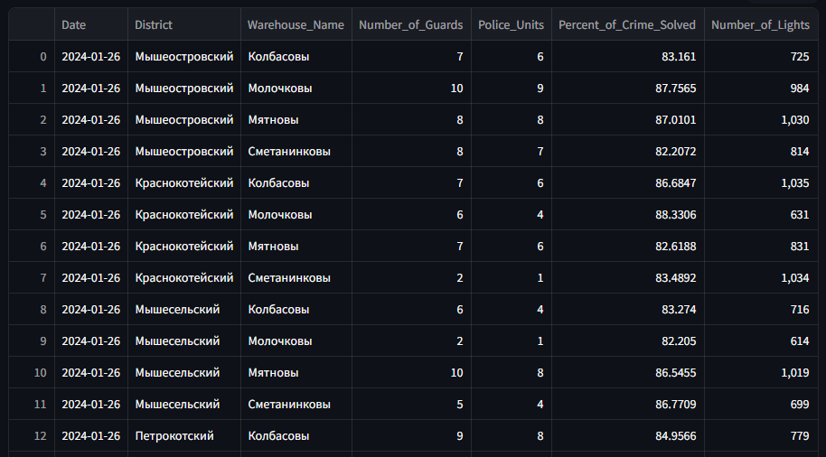
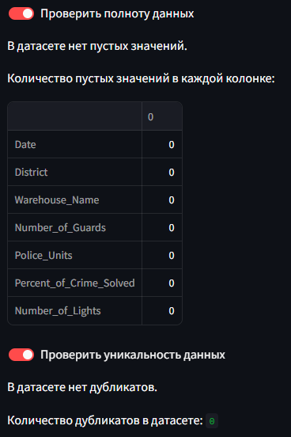
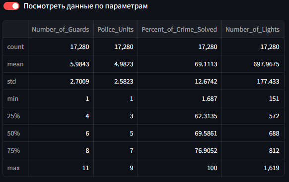
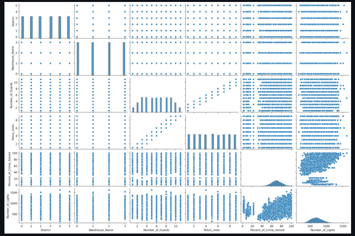
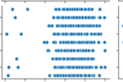

# Бандитский Сыроград

## Разведочный анализ данных
Перед тем, как начать анализировать, необходимо данные привести к нормальной форме, а именно:
* Посмотреть полноту данных, тоесть проверить есть ли нулевые значения. При работе с моделями очень важно, чтобы не было пустых значений, они могут исказить предсказание или выдвать не совсем точное значение, ухудшать точность модели.
* Проверить данные на уникальность, тоесть проверить нет ли повторяющихся строчек данных. Это так же влияет на точность анализа.

Технологии, которые я использую для разведки:
* python 3.9
* библиотека pandas для работы с файлами формата .csv
* библиотека streamlit для удобного отображения данных

Первым делом было замечено, что 3 первых столбца в датасетах идентичны, поэтому логично было бы их объеденить в один датасет. Для этого был реализован метод `save_main_dataset()`. Здесь считываются 2 исходных датасета и с помощью функции `merge` библиотеки pandas объединяются 2 датасета в один со сдвигом влево и данные сохраняются в новый датасет.

```python
def save_main_dataset():
    first_data = pd.read_csv('datasets/first_part.csv')
    second_data = pd.read_csv('datasets/second_part.csv')

    main_dataset = pd.merge(first_data, second_data[
        ['Date', 'District', 'Warehouse_Name', 'Percent_of_Crime_Solved', 'Number_of_Lights']],
                            on=['Date', 'District', 'Warehouse_Name'],
                            how='left')
    main_dataset.to_csv('datasets/main_dataset.csv', index=False)
```

Для оценки полноты данных создан метод `completeness()`. Здесь, с помощью функции `data.isnull().values.any():` просматриваем есть ли пустые значения. И выводим сумму всех пустых значений в каждом столбце с помощью функции `data.isnull().sum()`.

```python
# Полнота, проверка на пустые значения
def completeness():
    data = pd.read_csv('datasets/main_dataset.csv')

    if data.isnull().values.any():
        st.write("В датасете есть пустые значения.")
    else:
        st.write("В датасете нет пустых значений.")

    missing_values = data.isnull().sum()
    st.write("Количество пустых значений в каждой колонке:")
    st.write(missing_values)
```

Для проверки уникальности значений был создан метод `uniqueness()`. Здесь проверяем есть ли дубликаты с помощью метода `data.duplicated().any()`. Так же выводим кол-во повторяющихся строчек с помощью метода `data.duplicated().sum()`.

```python
def uniqueness():
    data = pd.read_csv('datasets/main_dataset.csv')

    if data.duplicated().any():
        st.write("В датасете есть дубликаты.")
    else:
        st.write("В датасете нет дубликатов.")

    duplicate_count = data.duplicated().sum()
    st.write("Количество дубликатов в датасете:", duplicate_count)
```
**Что же получается?**
Получился вот такой датасет после объединения



**А что с полнотой и уникальностью?**
Методы вывели следующую информацию



### Вывод по разведке и ответ на первый вопрос
* Данные представлены в полном объеме
* Данные не имеют повторяющихся значений

Можно сказать, что данные готовы к последующему анализу. Пока сложно оценить насколько эффективны собранные данные, необходимо создать модели анализа данных и оценить как каждый параметр влияет на другой параметр (решение в слеующем разделе и относится уже к 2 вопросу). 

## Реализация анализа данных. Достижение бизнес-цели
Для начала необходимо оценить параметры, для этого понадобится метод `describe()`. Вот, что я получаю:



* Количество охранников на складе может быть от 1 до 11, но в среднем их 5.9. В большинстве случаев охранников на складе - 8.
* Количество полицейских от 1 до 9, но в среднем из 4.9. В большинстве случаев их 7.
* Процент раскрытых преступлений по уничтожению фонарей от 1.68 до 100 процентов, но в среднем 69.11 (ух ты, полиция работает хорошо). В большинстве случаев процент 76.9 (очень-очень хорошо). 
* Количество фонарей от 151 до 1619, но в среднем 697.9. В большинстве случаев фонарей 812.

Пока можно сделать вывод о том, что полиция работает очень хорошо по раскрытию преступлений в области фонарей. Я считаю, что скорее всего дело в фонарях, скорее всего существуют районы, где фонарей очень мало, а охранников и полиции не хватает и все это влияет на преступность, связанную с похищением сыра. Это всего лишь догадки, поэтому необходимо анализировать дальше.

А дальше используется корреляционый анализ, чтобы понять, есть ли линейная зависимость. Для этого используется метод `correl()`, в этом методе сначала преобразуется дата, а после строковые данные преобразуются в числовые. Это необходимо сделать, чтобы мы могли работать с моделями машинного обучения. Далее отображаются диаграммы корреляции. Вот что получается:



График сложно читаем со скриншота, поэтому я оставлю ссылку на реализацию.

Итак, сразу видно, что единственная слабая корреляция возникает между параметрами кол-во полиции и кол-во охраны. Тоесть чем больше охраны на складе, тем больше полиции и наоборот. Больше линейных зависимостей нет, поэтому модель нужно выбирать нелинейную.

Далее я пробоавла различные модели случайный лес, градиентный спуск, регрессия. Но все заканчивалось тем, что модель имеет большую вероятность ошибки от 70 процентов. Поэтому, я решила проанализировать график отдельно для определенного склада и района. 

Я брала определенные названия районов и складов и смотрела как относится процент раскрытых преступлений разбитых фонарей к количеству полицейских. И увидела повторяющуюся картину:



Здесь по оси х процент, а по y кол-во полицеских. Можно сказать что до 30% разное кол-во полицейских и это скорее исключение из правил, в основном они все раскрывают.

### Общий вывод и ответ на второй вопрос
Судя по данным, можно сказать, что количество полицейских не снизит количество краж. Кражи никак не связаны с преступлениями с разбитыми фонарями. Я основываюсь на полученные графики и на то, что модели не смогли найти зависимость параметров. 

В чем может быть еще причина:

TODO: Скорее всего что-то с датами, попробовать разбить на месяца
